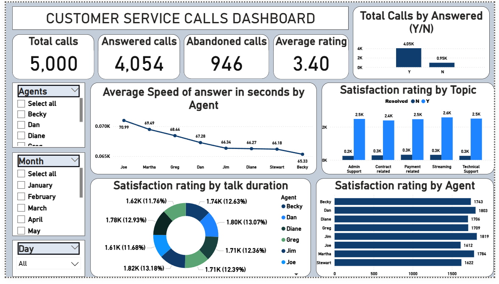
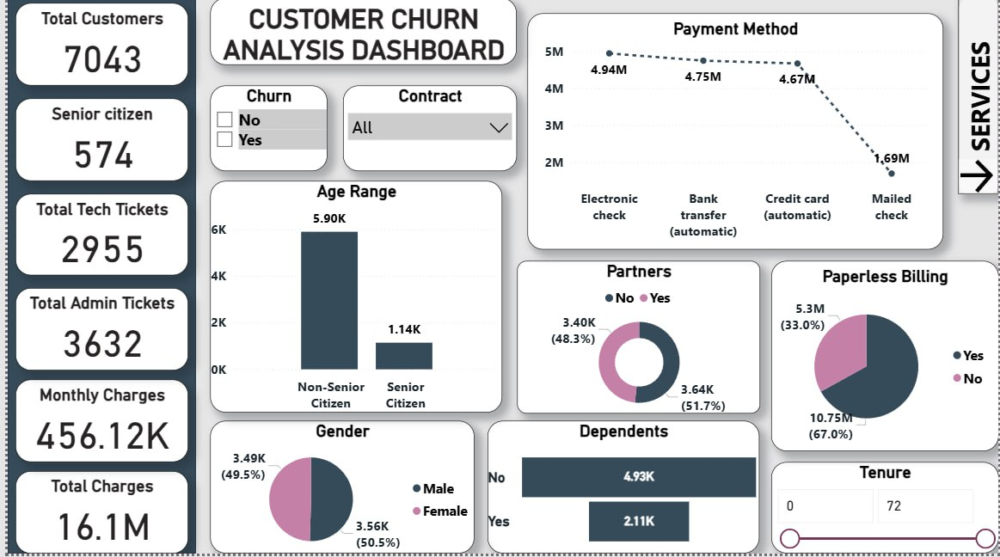
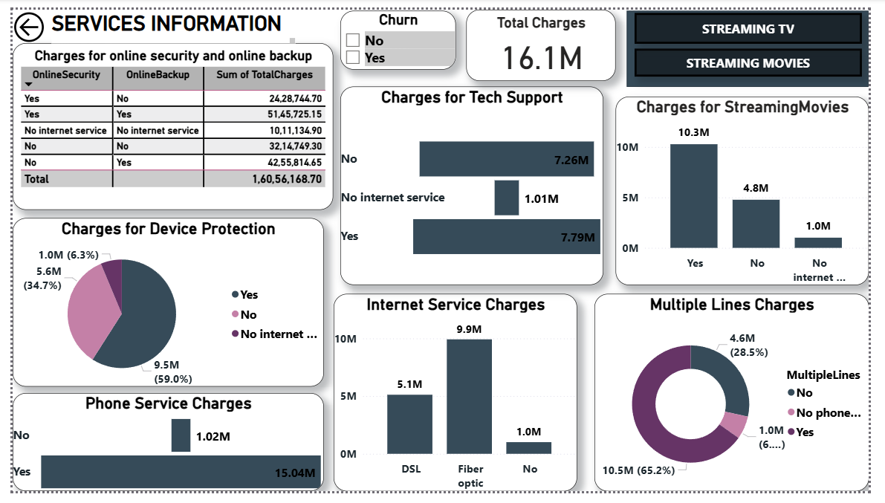
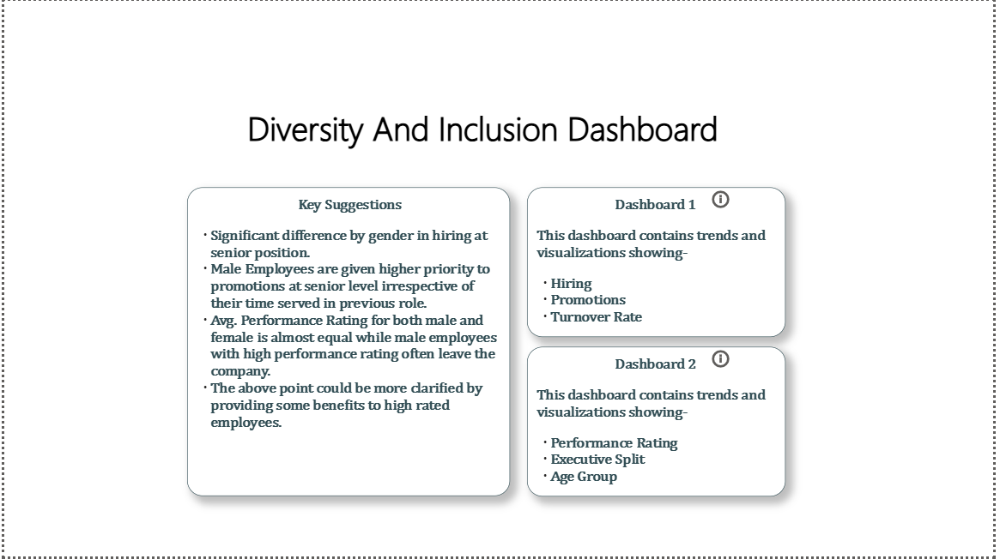
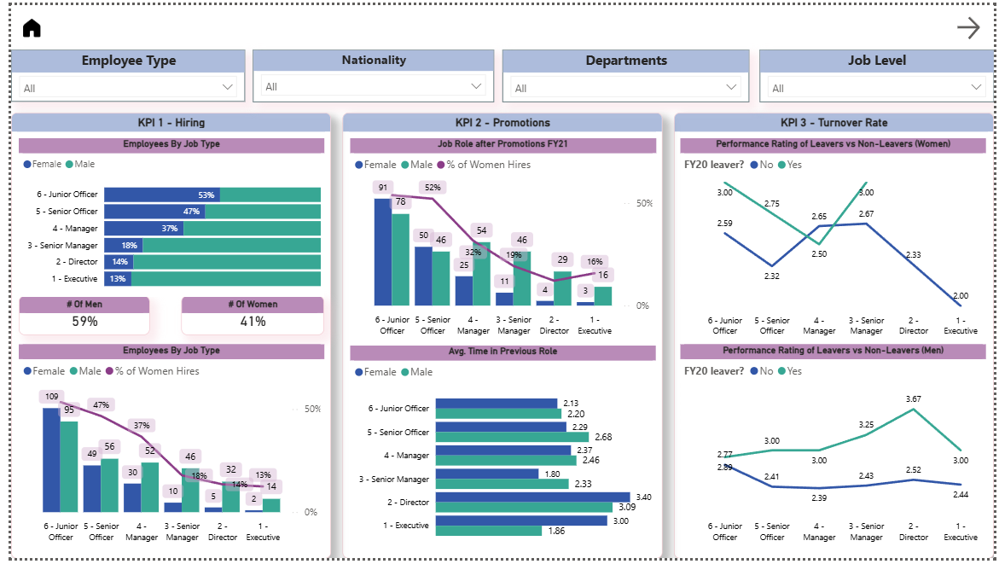
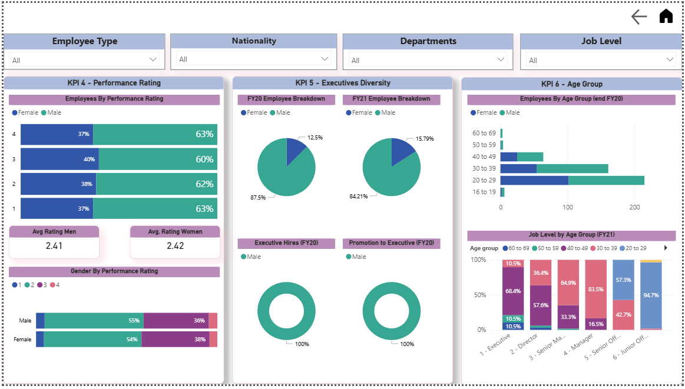

# 📊 PwC Switzerland – Power BI Job Simulation  
**Virtual Internship (Forage) | Completed October 2023**

---

## 📌 Overview

This repository contains my work completed as part of the PwC Switzerland Power BI Job Simulation hosted on Forage.

The simulation focused on solving real-world business scenarios using Power BI, covering:

- Operational performance analytics  
- Customer churn & revenue analysis  
- Diversity & inclusion workforce analytics  

All dashboards were built using Power BI with data modeling, DAX measures, and interactive visualizations.

---

## 🗂 Repository Structure
dataset/ → Raw datasets used for analysis

powerbi/ → Power BI (.pbix) dashboard files

screenshots/ → Dashboard preview images

insights/ → Task-wise business insights documentation

README.md → Project overview

---

# 📈 Task 1 – Call Centre Trends Analysis

### 🎯 Objective
Analyze call centre performance to understand service efficiency, agent performance, and customer satisfaction trends.

### 🔍 Key Areas Covered
- Total Calls & Abandonment Rate  
- Average Speed of Answer (ASA)  
- Satisfaction by Topic  
- Agent Performance Comparison  

### 📊 Dashboard Preview

📄 Detailed Insights:  
[View Task 1 Insights](insights/business-insights-task-1.md)

---

# 📉 Task 2 – Customer Churn & Revenue Analysis

### 🎯 Objective
Analyze customer demographics, service usage, and revenue distribution to understand churn-related patterns.

### 🔍 Key Areas Covered
- Customer Demographics (Age, Gender, Dependents, Partners)  
- Payment Method Distribution  
- Service-Level Revenue (Internet, Streaming, Phone, Tech Support)  
- Paperless Billing & Contract Insights  

### 📊 Dashboard Preview

📄 Detailed Insights:  
[View Task 2 Insights](insights/business-insights-task-2.md)

---

# 👥 Task 3 – Diversity & Inclusion Analytics

### 🎯 Objective
Evaluate workforce diversity across gender, job levels, promotions, turnover, and executive representation.

### 🔍 Key Areas Covered
- Gender Distribution by Job Level  
- Hiring & Promotion Trends  
- Executive Representation (FY20 vs FY21)  
- Performance Ratings by Gender  
- Age Group Distribution  

### 📊 Dashboard Preview

📄 **Detailed Insights:**  
[View Task 3 Insights](insights/business-insights-task-3.md)

---

# 🛠 Tools & Skills Demonstrated

- Power BI (Dashboard Development)  
- Data Modeling (Relational Model Design)  
- DAX Measures & Calculations  
- Data Transformation using Power Query  
- KPI Design & Business Metrics Tracking  
- Analytical Insight Documentation  
- Executive-Level Reporting  

---

# 📊 Dashboard Capabilities

- Interactive filters (Job Level, Departments, Tenure, Churn Status)  
- Multi-page analytical reporting  
- KPI cards & trend visualizations  
- Comparative gender & performance analysis  
- Revenue breakdown by services  

---

# 🎯 Competencies Demonstrated

- Business Intelligence Reporting  
- Customer Analytics  
- HR Analytics  
- Operational Performance Analysis  
- Data-Driven Insight Communication  

---

## 🏁 Summary

This project demonstrates the ability to:

- Translate business requirements into analytical dashboards  
- Build structured, interactive BI reports  
- Derive meaningful insights from operational and workforce data  
- Present findings in a clear, executive-ready format  

---

📌 *This project was completed as part of the PwC Switzerland Virtual Job Simulation program on Forage.*
